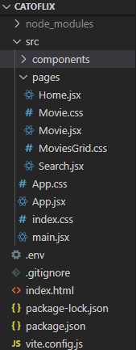
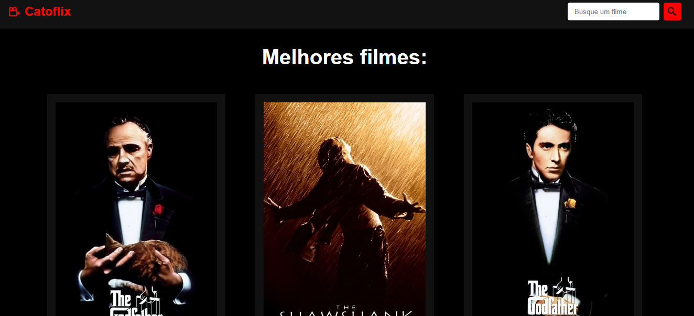
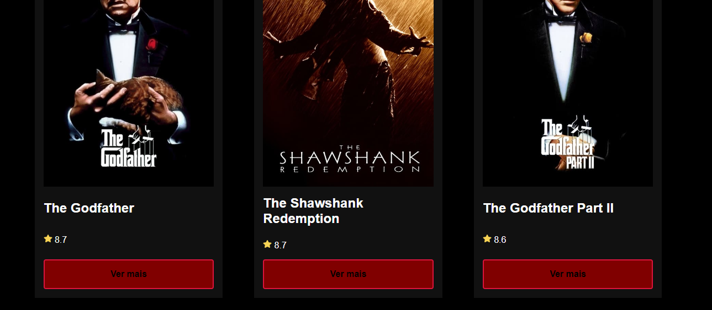
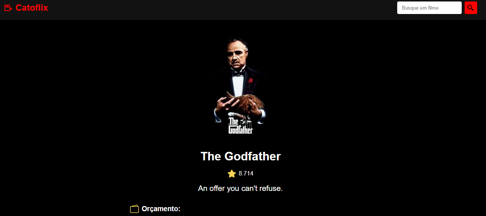
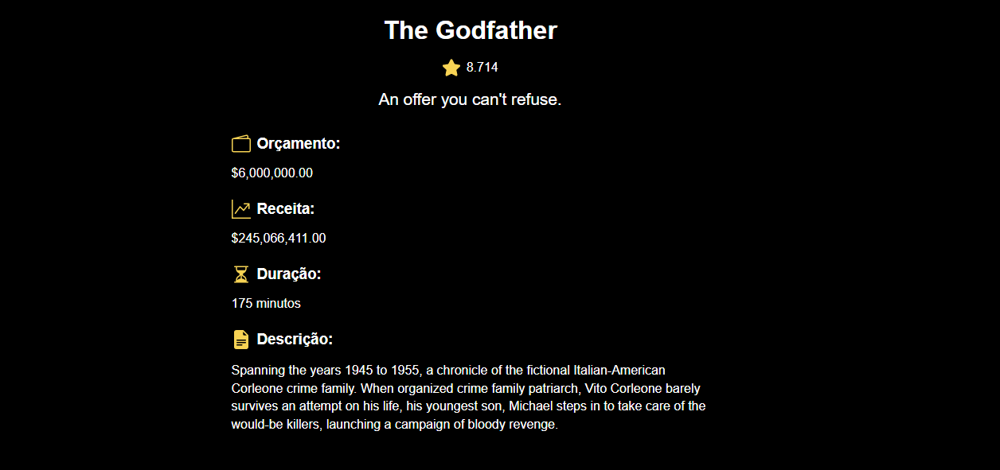

# Catoflix

###### Catoflix é uma aplicação web que consome uma API externa e pública de filmes e tv shows a partir de uma key (chave) disponibilizada somente para esta aplicação, através de uma requisição de API no site do The Movie Database (TMDB).

###### Site TMDB -> https://www.themoviedb.org/

## Diagrama de caso de uso

###### O diagrama abaixo representa um caso de uso com as funcionalidades da aplicação enquanto o usuário está acessando a interface gráfica.

## Arquitetura do Projeto

###### A aplicação foi desenvolvida na linguagem JavaScript e utiliza a biblioteca React.JS, a qual permitiu o desenvolvimento de componentes de estado no código. A arquitetura escolhida foi REST (Representational State Transfer), um estilo arquitetônico usado para desenvolver software distribuído baseado em comunicação por rede.

## Telas da Aplicação

###### Home

# ------------------------------------------------------------------------------

# ------------------------------------------------------------------------------

###### Resultado do botão 'Ver mais'

# ------------------------------------------------------------------------------

# ------------------------------------------------------------------------------
